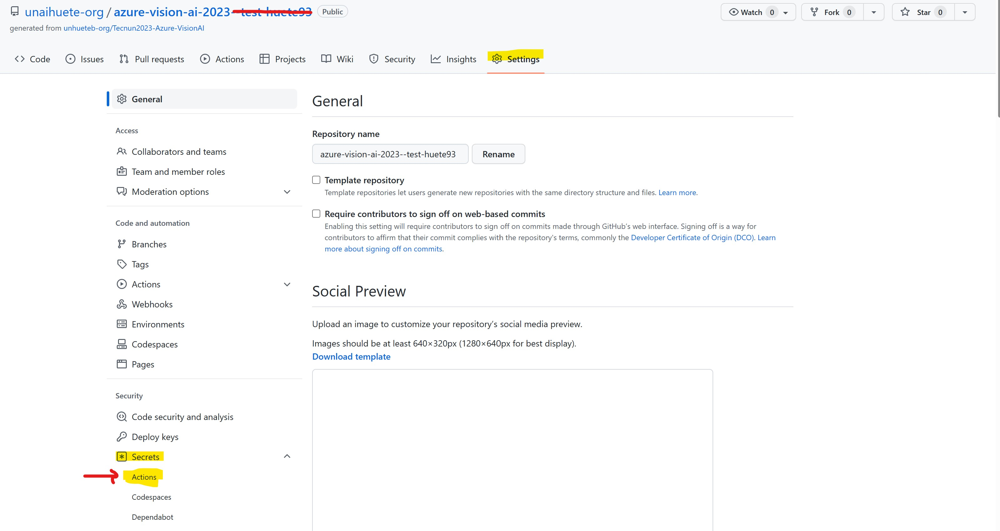
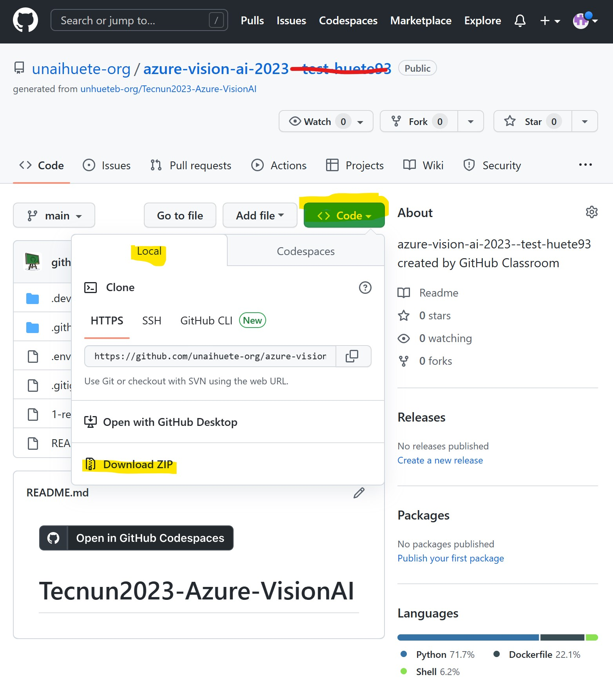
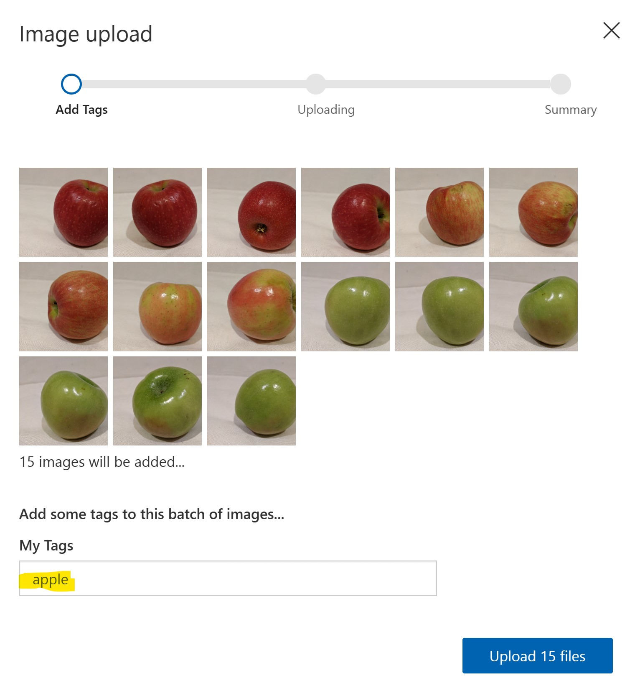
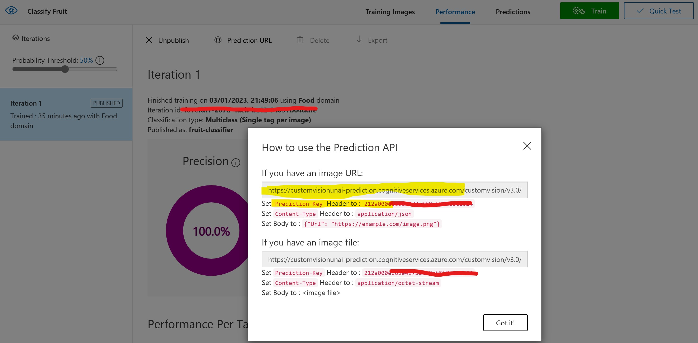

# Tecnun2023-Azure-VisionAI

# Prerequisites

Your teacher will onboard you into the process of opening the repository for the session.

You will receive a GitHub Classroom link that will provide:
- The repository for the labs/exercises
- **README.md** file with instructions to follow
- Lab files for each exercise
- GitHub Codespace -> a cloud development environment to test/try your code. 

# Exercise 1: Get Started with Cognitive Services

In this exercise, you'll get started with Cognitive Services by creating a **Cognitive Services** resource in your Azure subscription and using it from a client application. The goal of the exercise is not to gain expertise in any particular service, but rather to become familiar with a general pattern for provisioning and working with cognitive services as a developer.

## Provision a Cognitive Services resource

Azure Cognitive Services are cloud-based services that encapsulate artificial intelligence capabilities you can incorporate into your applications. You can provision individual cognitive services resources for specific APIs (for example, **Language** or **Computer Vision**), or you can provision a general **Cognitive Services** resource that provides access to multiple cognitive services APIs through a single endpoint and key. In this case, you'll use a single multi **Cognitive Services** resource, a single endpoint for multiple AI cognitive services.

1. Open the Azure portal at `https://portal.azure.com`, and sign in using the account associated with your Azure subscription.
2. Select the **Create a resource** button, search for *cognitive services*, and create a **Cognitive Services** resource with the following settings:
    - **Subscription**: *Your Azure subscription*
    - **Resource group**: *Choose or create a resource group (if you are using a restricted subscription, you may not have permission to create a new resource group - use the one provided)*
    - **Region**: *Choose any available region*
    - **Name**: *Enter a unique name*
    - **Pricing tier**: Standard S0
3. **Select the required checkboxes** and create the resource.
4. Wait for deployment to complete, and then view the deployment details.
5. Go to the resource and view its **Keys and Endpoint** page. **This page contains the information that you will need to connect to your resource** and use it from applications you develop. Specifically:
    - An HTTP *endpoint* to which client applications can send requests.
    - Two *keys* that can be used for authentication (client applications can use either key to authenticate).
    - The *location* where the resource is hosted. This is required for requests to some (but not all) APIs.

1. We need to keep this sensitive information (anyone with the data collected before could use your resource!) on a safe place to be able to use it on our GitHub environment. On your GitHub repository website, go to **Settings>Secrets>Actions**.

    

    - Create 2 **New repository secrets**.
        - Name: **COG_SERVICE_ENDPOINT** Secret: **The endpoint from your Cognitive Service resource**.
        - Name: **COG_SERVICE_KEY** Secret: **1 of the keys provided**

1. Repeat same process and same 2 keys below **Settings>Secrets>Codespaces** section.

1. Your code during this labs will get the neccesary sensitive information from GitHub Secrets, instead of hard coding it (risk of exposing it!).

## Use a REST Interface

The cognitive services APIs are REST-based, so you can consume them by submitting JSON requests over HTTP. In this example, you'll explore a console application that uses the **Language** REST API to perform language detection; but the basic principle is the same for all of the APIs supported by the Cognitive Services resource.


1. In GitHub Codespace, open the following file:

    - **Python**: 1-rest-client.py

    Open the code file and review the code it contains, noting the following details:
    - Various namespaces are imported to enable HTTP communication

    - The program accepts user input, and uses the **GetLanguage** function to call the Text Analytics language detection REST API for your cognitive services endpoint to detect the language of the text that was entered.
    - The request sent to the API consists of a JSON object containing the input data - in this case, a collection of **document** objects, each of which has an **id** and **text**.
    - The key and endpoint for your service is included in the request header to authenticate your client application. These information is read from **GitHub Secrets** (environment variables).

    - The response from the service is a JSON object, which the client application can parse.

4. Open the Terminal. Then enter the following language-specific command to run the program:

    **Python**

    ```
    python 1-rest-client.py
    ```

5. When prompted, enter some text and review the language that is detected by the service, which is returned in the JSON response. For example, try entering "Hello", "Bonjour", and "Gracias".
6. When you have finished testing the application, enter "quit" to stop the program.

## Use an SDK

You can write code that consumes cognitive services REST APIs directly, but there are **software development kits (SDKs) for many popular programming languages**, including Microsoft C#, Python, and Node.js. Using an SDK can greatly simplify development of applications that consume cognitive services.

1. In the terminal, run the following command to install neccesary libraries:

   
    **Python**

    ```
    pip install azure-ai-textanalytics==5.1.0
    ```

3. View the contents of the **1-sdk-client.py** (Python) file:
    

    Open the code file and review the code it contains, noting the following details:
    - The namespace for the SDK you installed is imported
    - The **GetLanguage** function uses the SDK to create a client for the service (using your secret endpoint and key) and then uses the client to detect the language of the text that was entered.
5. Return to the terminal and enter the following command to run the program:

    **Python**

    ```
    python 1-sdk-client.py
    ```

6. When prompted, enter some text and review the language that is detected by the service. For example, try entering "Goodbye", "Au revoir", and "Hasta la vista".
7. When you have finished testing the application, enter "quit" to stop the program.

> **Note**: Some languages that require Unicode character sets may not be recognized in this simple console application.


# Exercise 2: Analyze Images with Computer Vision

Computer vision is an artificial intelligence capability that enables software systems to interpret visual input by analyzing images. In Microsoft Azure, the **Computer Vision** cognitive service provides **pre-built models** for common computer vision tasks, including analysis of images to suggest captions and tags, detection of common objects, landmarks, celebrities, brands, and the presence of adult content. You can also use the Computer Vision service to analyze image color and formats, and to generate "smart-cropped" thumbnail images.

## Prepare to use the Computer Vision SDK

In this exercise, you'll complete a partially implemented client application that uses the **Computer Vision SDK** to analyze images.

1. In the **GitHub Codespace**, open the **Terminal**,  install the Computer Vision SDK package by running the appropriate command for your language preference:

**Python**

```
pip install azure-cognitiveservices-vision-computervision==0.7.0
```
    
4. File **2-image-analysis.py**(Python) contains a code file for the client application:


    Open the code file and at the top, under the existing namespace references, find the comment **Import namespaces**. Then, under this comment, add the following language-specific code to import the namespaces you will need to use the Computer Vision SDK:

**Python**

```Python
# import namespaces
from azure.cognitiveservices.vision.computervision import ComputerVisionClient
from azure.cognitiveservices.vision.computervision.models import VisualFeatureTypes
from msrest.authentication import CognitiveServicesCredentials
```
    
## View the images you will analyze

In this exercise, you will use the Computer Vision service to analyze multiple images.

1. In the **Explorer** tab, expand the **images>Exercise-2** folder and the **images** folder it contains.

2. Select each of the image files in turn to view them.

## Analyze an image to suggest a caption

Now you're ready to use the SDK to call the Computer Vision service and analyze an image.

1. In the code file for your client application (**2-image-analysis.py**), in the **Main** function, note that the code to load the configuration settings has been provided. Then find the comment **Authenticate Computer Vision client**. Then, under this comment, **add the following language-specific code** to create and authenticate a Computer Vision client object:


**Python**

```Python
# Authenticate Computer Vision client
credential = CognitiveServicesCredentials(cog_key) 
cv_client = ComputerVisionClient(cog_endpoint, credential)
```

2. In the **Main** function, under the code you just added, note that the code specifies the path to an image file and then passes the image path to two other functions (**AnalyzeImage** and **GetThumbnail**). These functions **are not yet fully implemented**.

3. In the **AnalyzeImage** function, under the comment **Specify features to be retrieved**, add the following code:

**Python**

```Python
# Specify features to be retrieved
features = [VisualFeatureTypes.description,
            VisualFeatureTypes.tags,
            VisualFeatureTypes.categories,
            VisualFeatureTypes.brands,
            VisualFeatureTypes.objects,
            VisualFeatureTypes.adult]
```
    
4. In the **AnalyzeImage** function, under the comment **Get image analysis**, add the following code (including the comments indicating where **you will add more code later.**):


**Python**

```Python
# Get image analysis
with open(image_file, mode="rb") as image_data:
    analysis = cv_client.analyze_image_in_stream(image_data , features)

# Get image description
for caption in analysis.description.captions:
    print("Description: '{}' (confidence: {:.2f}%)".format(caption.text, caption.confidence * 100))

# Get image tags


# Get image categories 


# Get brands in the image


# Get objects in the image


# Get moderation ratings

```
    
5. Save your changes and return to the **Terminal** for the **image-analysis** folder, and enter the following command to run the program with the argument **images/Exercise-2/street.jpg**:


**Python**

```
python 2-image-analysis.py images/Exercise-2/street.jpg
```
    
6. Observe the output, which should include a suggested caption for the **street.jpg** image.
7. Run the program again, this time with the argument **images/building.jpg** to see the caption that gets generated for the **building.jpg** image.
8. Repeat the previous step to generate a caption for the **images/person.jpg** file.

## Get suggested tags for an image

It can sometimes be useful to identify relevant *tags* that provide clues about the contents of an image.

1. In the **AnalyzeImage** function, under the comment **Get image tags**, add the following code:

**Python**

```Python
# Get image tags
if (len(analysis.tags) > 0):
    print("Tags: ")
    for tag in analysis.tags:
        print(" -'{}' (confidence: {:.2f}%)".format(tag.name, tag.confidence * 100))
```

2. Save your changes and run the program once for each of the image files in the **images** folder, observing that in addition to the image caption, a list of suggested tags is displayed.

## Get image categories

The Computer Vision service can suggest *categories* for images, and within each category it can identify well-known landmarks.

1. In the **AnalyzeImage** function, under the comment **Get image categories**, add the following code:


**Python**

```Python
# Get image categories
if (len(analysis.categories) > 0):
    print("Categories:")
    landmarks = []
    for category in analysis.categories:
        # Print the category
        print(" -'{}' (confidence: {:.2f}%)".format(category.name, category.score * 100))
        if category.detail:
            # Get landmarks in this category
            if category.detail.landmarks:
                for landmark in category.detail.landmarks:
                    if landmark not in landmarks:
                        landmarks.append(landmark)

    # If there were landmarks, list them
    if len(landmarks) > 0:
        print("Landmarks:")
        for landmark in landmarks:
            print(" -'{}' (confidence: {:.2f}%)".format(landmark.name, landmark.confidence * 100))

```
    
2. Save your changes and run the program once for each of the image files in the **images** folder, observing that in addition to the image caption and tags, a list of suggested categories is displayed along with any recognized landmarks (in particular in the **building.jpg** image).

## Get brands in an image

Some brands are visually recognizable from logo's, even when the name of the brand is not displayed. The Computer Vision service is trained to identify thousands of well-known brands.

1. In the **AnalyzeImage** function, under the comment **Get brands in the image**, add the following code:

**Python**

```Python
# Get brands in the image
if (len(analysis.brands) > 0):
    print("Brands: ")
    for brand in analysis.brands:
        print(" -'{}' (confidence: {:.2f}%)".format(brand.name, brand.confidence * 100))
```
    
2. Save your changes and run the program once for each of the image files in the **images** folder, observing any brands that are identified (specifically, in the **person.jpg** image).

## Detect and locate objects in an image

*Object detection* is a specific form of computer vision in which individual objects within an image are identified and their location indicated by a bounding box..

1. In the **AnalyzeImage** function, under the comment **Get objects in the image**, add the following code:


**Python**

```Python
# Get objects in the image
if len(analysis.objects) > 0:
    print("Objects in image:")

    # Prepare image for drawing
    fig = plt.figure(figsize=(8, 8))
    plt.axis('off')
    image = Image.open(image_file)
    draw = ImageDraw.Draw(image)
    color = 'cyan'
    for detected_object in analysis.objects:
        # Print object name
        print(" -{} (confidence: {:.2f}%)".format(detected_object.object_property, detected_object.confidence * 100))
        
        # Draw object bounding box
        r = detected_object.rectangle
        bounding_box = ((r.x, r.y), (r.x + r.w, r.y + r.h))
        draw.rectangle(bounding_box, outline=color, width=3)
        plt.annotate(detected_object.object_property,(r.x, r.y), backgroundcolor=color)
    # Save annotated image
    plt.imshow(image)
    outputfile = 'objects.jpg'
    fig.savefig(outputfile)
    print('  Results saved in', outputfile)
```
    
2. Save your changes and run the program once for each of the image files in the **images** folder, observing any objects that are detected. After each run, view the **objects.jpg** file that is generated in the same folder as your code file to **see the annotated objects**.

## Get moderation ratings for an image

Some images may not be suitable for all audiences, and you may need to apply some moderation to identify images that are adult or violent in nature.

1. In the **AnalyzeImage** function, under the comment **Get moderation ratings**, add the following code:

**Python**

```Python
# Get moderation ratings
ratings = 'Ratings:\n -Adult: {}\n -Racy: {}\n -Gore: {}'.format(analysis.adult.is_adult_content,
                                                                    analysis.adult.is_racy_content,
                                                                    analysis.adult.is_gory_content)
print(ratings)
```
    
2. Save your changes and run the program once for each of the image files in the **images** folder, observing the ratings for each image.

> **Note**: In the preceding tasks, you used a single method to analyze the image, and then incrementally added code to parse and display the results. **The SDK also provides individual methods** for suggesting captions, identifying tags, detecting objects, and so on - meaning that you can use the most appropriate method to return only the information you need, reducing the size of the data payload that needs to be returned. See the [.NET SDK documentation](https://docs.microsoft.com/dotnet/api/overview/azure/cognitiveservices/client/computervision?view=azure-dotnet) or [Python SDK documentation](https://docs.microsoft.com/python/api/overview/azure/cognitiveservices/computervision?view=azure-python) for more details.

## Generate a thumbnail image

In some cases, you may need to create a smaller version of an image named a *thumbnail*, cropping it to include the main visual subject within new image dimensions.

1. In your code file, find the **GetThumbnail** function; and under the comment **Generate a thumbnail**, add the following code:


**Python**

```Python
# Generate a thumbnail
with open(image_file, mode="rb") as image_data:
    # Get thumbnail data
    thumbnail_stream = cv_client.generate_thumbnail_in_stream(100, 100, image_data, True)

# Save thumbnail image
thumbnail_file_name = 'thumbnail.png'
with open(thumbnail_file_name, "wb") as thumbnail_file:
    for chunk in thumbnail_stream:
        thumbnail_file.write(chunk)

print('Thumbnail saved in.', thumbnail_file_name)
```
    
2. Save your changes and run the program once for each of the image files in the **images** folder, opening the **thumbnail.jpg** file that is generated in the same folder as your code file for each image.

# Exercise 3: Classify Images with Custom Vision

The **Custom Vision** service enables you to create computer vision models that are trained on your own images. You can use it to train *image classification* and *object detection* models; which you can then publish and consume from applications.

In this exercise, you will use the Custom Vision service to train an image classification model that can identify three classes of fruit (apple, banana, and orange).

## Create Custom Vision resources

Before you can train a model, you will need Azure resources for *training* and *prediction*. You can create **Custom Vision** resources for each of these tasks, or you can create a single **Cognitive Services** resource and use it for either (or both).

In this exercise, you'll create **Custom Vision resources for training and prediction** so that you can manage access and costs for these workloads separately.

1. In a new browser tab, open the Azure portal at `https://portal.azure.com`, and sign in using the Microsoft account associated with your Azure subscription.
2. Select the **Create a resource** button, search for *custom vision*, and create a **Custom Vision** resource with the following settings:
    - **Create options**: Both
    - **Subscription**: *Your Azure subscription*
    - **Resource group**: *Choose or create a resource group (if you are using a restricted subscription, you may not have permission to create a new resource group - use the one provided)*
    - **Region**: *Choose any available region*
    - **Name**: *Enter a unique name*
    - **Training pricing tier**: F0
    - **Prediction pricing tier**: F0

    > **Note**: If you already have an F0 custom vision service in your subscription, select **S0** for this one.

1. Click on **Review+create>Create**
3. Wait for the resources to be created, and then view the deployment details and note that two Custom Vision resources are provisioned; one for training, and another for prediction (evident by the **-Prediction** suffix). You can view these by navigating to the resource group where you created them.

> **Important**: **Each resource has its own *endpoint* and *keys*, which are used to manage access from your code**. To train an image classification model, your code must use the *training* resource (with its endpoint and key); and to use the trained model to predict image classes, your code must use the *prediction* resource (with its endpoint and key).

## Create a Custom Vision project

To train an image classification model, you need to create a Custom Vision project based on your training resource. To do this, you'll use the Custom Vision portal.

1. In the GitHub repository, click on **Code>Local>Download ZIP** to download the repository, which contains the images needed for next steps. Unzip the folder to use it later.

    


2. In a new browser tab, open the Custom Vision portal at `https://customvision.ai`. If prompted, sign in using the Microsoft account associated with your Azure subscription and agree to the terms of service.
3. In the Custom Vision portal, create a **new project** with the following settings:
    - **Name**: Classify Fruit
    - **Description**: Image classification for fruit
    - **Resource**: *The Custom Vision resource you created previously*
    - **Project Types**: Classification
    - **Classification Types**: Multiclass (single tag per image)
    - **Domains**: Food
1. **Create Project**
4. In the new project, click **\[+\] Add images**, and select all of the files in the downloaded repository (unzipped folder), in the **images/Exercise-3/apple** folder you viewed previously. Then upload the image files, specifying the tag *apple*, like this:


   
5. Repeat the previous step to upload the images in the **banana** folder with the tag *banana*, and the images in the **orange** folder with the tag *orange*.
6. Explore the images you have uploaded in the Custom Vision project - there should be 15 images of each class.
    
7. In the Custom Vision project, above the images, click **Train** to train a classification model using the tagged images. Select the **Quick Training** option, and then wait for the training iteration to complete (this may take some minutes).
8. When the model iteration (Iteration 1) has been trained, review the *Precision*, *Recall*, and *AP* performance metrics - these measure the prediction accuracy of the classification model, and should all be high. **Click on the information icon next to the metrics to understand them**.

> **Note**: The performance metrics are based on a probability threshold of 50% for each prediction (in other words, if the model calculates a 50% or higher probability that an image is of a particular class, then that class is predicted). You can adjust this at the top-left of the page.

## Test the model

Now that you've trained the model, you can test it.

1. Above the performance metrics, click **Quick Test**.
2. In the **Image URL** box, type `https://aka.ms/apple-image` and click &#10132;
3. View the predictions returned by your model - the probability score for *apple* should be the highest.

4. Close the **Quick Test** window.

## View the project settings

The project you have created has been assigned a unique identifier, which you will need to specify in any code that interacts with it. Lets find it as we want to call our model from code.

1. Click the *settings* (&#9881;) icon at the top right of the **Performance** page to view the project settings.
2. Under **General** (on the left), note/copy the **Project Id** that uniquely identifies this project.

## Publish the image classification model

Now you're ready to publish your trained model so that it can be used from a client application.

1. In the Custom Vision portal, on the **Performance** page,  click **&#128504; Publish** to publish the trained model with the following settings:
    - **Model name**: fruit-classifier
    - **Prediction Resource**: *The **prediction** resource you created previously which ends with "-Prediction" (<u>not</u> the training resource)*.
1. **Publish**
2. When the model is published, click on the **Prediction URL** option. Collect the highlighted information:
    - **Prediction endpoint** -> just the highlighted section, including last "/". For example "https://xxxxxxxxxx.cognitiveservices.azure.com/"
    - **Prediction-Key**

    

## Use the image classifier from a client application

Now that you've published the image classification model, you can use it from a client application. 

1. In GitHub Codespace, open a **Terminal** and run the following command to install necessary libraries.

**Python**

```
pip install azure-cognitiveservices-vision-customvision==3.1.0
```

> **Note**: The Python SDK package includes both training and prediction packages, and may already be installed.


3. Lets keep the sensitive configuration values as GitHub Secrets (remember, anyone could call your model if the get these information!). On your GitHub repository website, go to **Settings>Secrets>Actions**.

    

    - Create 4 **New repository secrets**.
        - Name: **PREDICTIONENDPOINT** Secret: **The endpoint from your Custom Vision prediction resource**.
        - Name: **PREDICTIONKEY** Secret: **Key for the service**
        - Name: **PROJECTID** Secret: **ID for the created model**
        - Name: **MODELNAME** Secret **fruit-classifier** (this is the name given to the trained model)

1. Repeat same process and same 4 keys below **Settings>Secrets>Codespaces** section.


4. Open the code file for your client application  *3-test-classification.py*  (Python) and review the code it contains, noting the following details:
    - Namespaces from the package you installed are imported
    - The **Main** function retrieves the configuration settings, and uses the key and endpoint to create an authenticated **CustomVisionPredictionClient**.
    - The prediction client object is used to predict a class for each image in the **test-images** folder, specifying the project ID and model name for each request. Each prediction includes a probability for each possible class, and only predicted tags with a probability greater than 50% are displayed.
5. Return the **Terminal** for the **test-classifier** folder, and enter the following SDK-specific command to run the program:

**Python**

```
python 3-test-classifier.py
```

6. View the label (tag) and probability scores for each prediction. You can view the images in the **test-images** folder to verify that the model has classified them correctly.

## More information

For more information about image classification with the Custom Vision service, see the [Custom Vision documentation](https://docs.microsoft.com/azure/cognitive-services/custom-vision-service/).

# Exercise 4: Detect Objects in Images with Custom Vision

In this exercise, you will use the Custom Vision service to train an *object detection* model that can detect and locate three classes of fruit (apple, banana, and orange) in an image.

## Create Custom Vision resources

You will reuse the Custom Vision  training and predicition resource from previous exercise.

## Create a Custom Vision project

To train an object detection model, you need to create a Custom Vision project based on your training resource. To do this, you'll use the Custom Vision portal.

1. In a new browser tab, open the Custom Vision portal at `https://customvision.ai`, and sign in using the Microsoft account associated with your Azure subscription.
2. Create a **new project** with the following settings:
    - **Name**: Detect Fruit
    - **Description**: Object detection for fruit.
    - **Resource**: *The Custom Vision resource you created previously*
    - **Project Types**: Object Detection
    - **Domains**: General
3. Wait for the project to be created and opened in the browser.

## Add and tag images

To train an object detection model, you need to upload images that contain the classes you want the model to identify, and tag them to indicate bounding boxes for each object instance.

1. In GitHub Codespace, view the training images in the **images/Exercise-4/training-images** folder. This folder contains images of fruit.
2. In the Custom Vision portal, in your object detection project, select **Add images** and upload all of the images in the extracted folder (from the extracted zip repository). **Upload xx files**.
3. After the images have been uploaded, select the first one to open it.
4. Hold the mouse over any object in the image until an automatically detected region/area is displayed like the image below. Then select the object, and if necessary resize the region to surround it.

    

    Alternatively, you can simply drag around the object to create a region.

5. When the region surrounds the object, **add a region tag** with the appropriate object type (*apple*, *banana*, or *orange*) as shown here:

6. Select and tag each other object in the image, resizing the regions and adding new tags as required.


7. Use the **>** link on the right to go to the next image, and tag its objects. Then just keep working through the entire image collection, tagging each apple, banana, and orange.

8. When you have finished tagging the last image, close the **Image Detail** editor and on the **Training Images** page, under **Tags**, select **Tagged** to see all of your tagged images.

>NOTE: you need at least 15 tagged images for each object in order to train the model!

## Train and test a model

Now that you've tagged the images in your project, you're ready to train a model.

1. In the Custom Vision project, click **Train** to train an object detection model using the tagged images. Select the **Quick Training** option.
2. Wait for training to complete (it might take ten minutes or so), and then review the *Precision*, *Recall*, and *mAP* performance metrics - these measure the prediction accuracy of the classification model, and should all be high.

>NOTE: click on the information (i) icons to understand the metrics provided.

3. At the top right of the page, click **Quick Test**, and then in the **Image URL** box, enter `https://aka.ms/apple-orange` and view the prediction that is generated. Then close the **Quick Test** window.

## Publish the object detection model

Now you're ready to publish your trained model so that it can be used from a client application.

1. In the Custom Vision portal, on the **Performance** page,  click **&#128504; Publish** to publish the trained model with the following settings:
    - **Model name**: fruit-detector
    - **Prediction Resource**: *The **prediction** resource you created previously which ends with "-Prediction" (<u>not</u> the training resource)*.

3. On the Custom Vision portal home page, at the top right, click the *settings* (&#9881;) icon to view the settings for your Custom Vision model. Copy and keep the **Project Name** and **Project Id**, as you will need it to call you model from code.

3. Lets keep the sensitive configuration values as GitHub Secrets (remember, anyone could call your model if the get these information!). On your GitHub repository website, go to **Settings>Secrets>Actions**.

    

    - Create 2 **New repository secrets**.
        - Name: **PROJECTID2** Secret: **ID for the created model**
        - Name: **MODELNAME2** Secret **fruit-detector** (this is the name given to the trained model)

1. Repeat same process and same 2 keys below **Settings>Secrets>Codespaces** section.

>NOTE: you will reuse the prediction endpoint and key from previous exercise, but you will call a different model.


## Use the image classifier from a client application

Now that you've published the image classification model, you can use it from a client application. 

1. In GitHub Codespace, browse to the **4-test-detector.py** file.

2. Open a **Terminal**. Then enter the following SDK-specific command to install the Custom Vision Prediction package:

**Python**

```
pip install azure-cognitiveservices-vision-customvision==3.1.0
```

> **Note**: The Python SDK package includes both training and prediction packages, and may already be installed.

4. Open the code file for your client application (*test-detector.py* for Python) and review the code it contains, noting the following details:
    - Namespaces from the package you installed are imported
    - The **Main** function retrieves the configuration settings (from GitHub Secrets), and uses the key and endpoint to create an authenticated **CustomVisionPredictionClient**.
    - The prediction client object is used to get object detection predictions for the **produce.jpg** image, specifying the project ID and model name in the request. The predicted tagged regions are then drawn on the image, and the result is saved as **output.jpg**.
5. Return to the integrated terminal for the **test-detector** folder, and enter the following command to run the program:

**Python**

```
python 4-test-detector.py
```

6. After the program has completed, view the resulting **output.jpg** file to see the detected objects in the image.

## More information

For more information about object detection with the Custom Vision service, see the [Custom Vision documentation](https://docs.microsoft.com/azure/cognitive-services/custom-vision-service/).


# Exercise 5: Detect and Analyze Faces

The ability to detect and analyze human faces is a core AI capability. In this exercise, you'll explore one of the Azure Cognitive Services that you can use to work with faces in images: the **Faces** service (**Computer Vision** service can also be used)

While the **Computer Vision** service offers basic face detection (along with many other image analysis capabilities), the **Face** service provides more comprehensive functionality for facial analysis and recognition.

> **Note**: From June 21st 2022, capabilities of cognitive services that return personally identifiable information are restricted to customers who have been granted [limited access](https://docs.microsoft.com/azure/cognitive-services/cognitive-services-limited-access). Additionally, capabilities that infer emotional state are no longer available. These restrictions may affect this lab exercise. We're working to address this, but in the meantime you may experience some errors when following the steps below; for which we apologize. For more details about the changes Microsoft has made, and why - see [Responsible AI investments and safeguards for facial recognition](https://azure.microsoft.com/blog/responsible-ai-investments-and-safeguards-for-facial-recognition/).

## Provision a Cognitive Services resource

We are going to use the multi **Cognitive Service** resource from previous exercises.


## Prepare to use the Face SDK

2. In GitHub Codespaces, open a terminal. Then install the Face SDK package by running the appropriate command for your language preference:

    **Python**

    ```
    pip install azure-cognitiveservices-vision-face==0.4.1
    ```
    
3. View the contents of the **5-analyze-faces.py** file.

4. The **endpoint** and an authentication **key** for your cognitive services resource will be taken from the GitHub Secrets service (setup in previous exercise for your Corgnitive Service resource).


6. On the code file and at the top, under the existing namespace references, find the comment **Import namespaces**. Then, under this comment, add the following language-specific code to import the namespaces you will need to use the Computer Vision SDK:

    **Python**

    ```Python
    # Import namespaces
    from azure.cognitiveservices.vision.face import FaceClient
    from azure.cognitiveservices.vision.face.models import FaceAttributeType
    from msrest.authentication import CognitiveServicesCredentials
    ```

7. In the **Main** function, note that the code to load the configuration settings has been provided. Then find the comment **Authenticate Face client**. Then, under this comment, add the following language-specific code to create and authenticate a **FaceClient** object:

    

    **Python**

    ```Python
    # Authenticate Face client
    credentials = CognitiveServicesCredentials(cog_key)
    face_client = FaceClient(cog_endpoint, credentials)
    ```

8. In the **Main** function, under the code you just added, note that the code displays a menu that enables you to call functions in your code to explore the capabilities of the Face service. You will implement these functions in the remainder of this exercise.

## Detect and analyze faces

One of the most fundamental capabilities of the Face service is to detect faces in an image, and determine their attributes, such as head pose, blur, the presence of spectacles, and so on.

1. In the code file for your application, in the **Main** function, examine the code that runs if the user selects menu option **1**. This code calls the **DetectFaces** function, passing the path to an image file.
2. Find the **DetectFaces** function in the code file, and under the comment **Specify facial features to be retrieved**, add the following code:

    

    **Python**

    ```Python
    # Specify facial features to be retrieved
    features = [FaceAttributeType.occlusion,
                FaceAttributeType.blur,
                FaceAttributeType.glasses]
    ```

3. In the **DetectFaces** function, under the code you just added, find the comment **Get faces** and add the following code:


    **Python**

    ```Python
    # Get faces
    with open(image_file, mode="rb") as image_data:
        detected_faces = face_client.face.detect_with_stream(image=image_data,
            return_face_attributes=features,                     return_face_id=False)

        if len(detected_faces) > 0:
            print(len(detected_faces), 'faces detected.')

            # Prepare image for drawing
            fig = plt.figure(figsize=(8, 6))
            plt.axis('off')
            image = Image.open(image_file)
            draw = ImageDraw.Draw(image)
            color = 'lightgreen'
            face_count = 0

            # Draw and annotate each face
            for face in detected_faces:

                # Get face properties
                face_count += 1
                print('\nFace number {}'.format(face_count))

                detected_attributes = face.face_attributes.as_dict()
                if 'blur' in detected_attributes:
                    print(' - Blur:')
                    for blur_name in detected_attributes['blur']:
                        print('   - {}: {}'.format(blur_name, detected_attributes['blur'][blur_name]))
                        
                if 'occlusion' in detected_attributes:
                    print(' - Occlusion:')
                    for occlusion_name in detected_attributes['occlusion']:
                        print('   - {}: {}'.format(occlusion_name, detected_attributes['occlusion'][occlusion_name]))

                if 'glasses' in detected_attributes:
                    print(' - Glasses:{}'.format(detected_attributes['glasses']))

                # Draw and annotate face
                r = face.face_rectangle
                bounding_box = ((r.left, r.top), (r.left + r.width, r.top + r.height))
                draw = ImageDraw.Draw(image)
                draw.rectangle(bounding_box, outline=color, width=5)
                annotation = 'Face ID: {}'.format(face.face_id)
                plt.annotate(annotation,(r.left, r.top), backgroundcolor=color)

            # Save annotated image
            plt.imshow(image)
            outputfile = 'detected_faces.jpg'
            fig.savefig(outputfile)

            print('\nResults saved in', outputfile)
    ```

4. Examine the code you added to the **DetectFaces** function. It analyzes an image file and detects any faces it contains, including attributes for age, emotions, and the presence of spectacles. The details of each face are displayed, including a unique face identifier that is assigned to each face; and the location of the faces is indicated on the image using a bounding box.
5. Save your changes and return to **Terminal**, and enter the following command to run the program:

    **Python**

    ```
    python 5-analyze-faces.py
    ```

6. When prompted, enter **1** and observe the output, which should include the ID and attributes of each face detected.
7. View the **detected_faces.jpg** file that is generated in the same folder as your code file to see the annotated faces.

## More information

There are several additional features available within the **Face** service, but following the [Responsible AI Standard](https://aka.ms/aah91ff) those are restricted behind a Limited Access policy. These features include identifying, verifying, and creating facial recognition models. To learn more and apply for access, see the [Limited Access for Cognitive Services](https://docs.microsoft.com/en-us/azure/cognitive-services/cognitive-services-limited-access).

For more information about using the **Computer Vision** service for face detection, see the [Computer Vision documentation](https://docs.microsoft.com/azure/cognitive-services/computer-vision/concept-detecting-faces).

To learn more about the **Face** service, see the [Face documentation](https://docs.microsoft.com/azure/cognitive-services/face/).

# Exercise 6: Read Text in Images

Optical character recognition (OCR) is a subset of computer vision that deals with reading text in images and documents. The **Computer Vision** service provides two APIs for reading text, which you'll explore in this exercise.


## Provision a Cognitive Services resource

We are going to use the multi **Cognitive Service** resource from previous exercises.

## Prepare to use the Computer Vision SDK

In this exercise, you'll complete a partially implemented client application that uses the Computer Vision SDK to read text.


2. Open a **Terminal** . Then install the Computer Vision SDK package by running the appropriate command for your language preference:


**Python**

```
pip install azure-cognitiveservices-vision-computervision==0.7.0
```

3. The **endpoint** and an authentication **key** for your cognitive services resource will be read from the GitHub Secrets service.

4. Open the **6-read-textpy** code file and at the top, under the existing namespace references, find the comment **Import namespaces**. Then, under this comment, add the following language-specific code to import the namespaces you will need to use the Computer Vision SDK:


**Python**

```Python
# import namespaces
from azure.cognitiveservices.vision.computervision import ComputerVisionClient
from azure.cognitiveservices.vision.computervision.models import OperationStatusCodes
from msrest.authentication import CognitiveServicesCredentials
```

5. In the code file for your client application, in the **Main** function, note that the code to load the configuration settings has been provided. Then find the comment **Authenticate Computer Vision client**. Then, under this comment, add the following language-specific code to create and authenticate a Computer Vision client object:


**Python**

```Python
# Authenticate Computer Vision client
credential = CognitiveServicesCredentials(cog_key) 
cv_client = ComputerVisionClient(cog_endpoint, credential)
```

## Use the Read API to read text from an image

The **Read** API uses a newer text recognition model and generally performs better for larger images that contain a lot of text, but will work for any amount of text. It also supports text extraction from *.pdf* files, and can recognize both printed text and handwritten text in multiple languages.

The **Read** API uses an asynchronous operation model, in which a request to start text recognition is submitted; and the operation ID returned from the request can subsequently be used to check progress and retrieve results.

1. In the code file for your application, in the **Main** function, examine the code that runs if the user selects menu option **1**. This code calls the **GetTextRead** function, passing the path to an image  file.
2. In the **images/Exercise-6** folder, click on **Lincoln.jpg** to view the file that your code will process.
3. Back in the code file , find the **GetTextRead** function, and under the existing code that prints a message to the console, add the following code:


**Python**

```Python
# Use Read API to read text in image
with open(image_file, mode="rb") as image_data:
    read_op = cv_client.read_in_stream(image_data, raw=True)

    # Get the async operation ID so we can check for the results
    operation_location = read_op.headers["Operation-Location"]
    operation_id = operation_location.split("/")[-1]

    # Wait for the asynchronous operation to complete
    while True:
        read_results = cv_client.get_read_result(operation_id)
        if read_results.status not in [OperationStatusCodes.running, OperationStatusCodes.not_started]:
            break
        time.sleep(1)

    # If the operation was successfully, process the text line by line
    if read_results.status == OperationStatusCodes.succeeded:
        for page in read_results.analyze_result.read_results:
            for line in page.lines:
                print(line.text)
                # Uncomment the following line if you'd like to see the bounding box 
                #print(line.bounding_box)
         return 1

    else:
            print("Text read failed:\n{}".format(read_results.status))
            return 0
```

4. Examine the code you added to the **GetTextRead** function. It submits a request for a read operation, and then repeatedly checks status until the operation has completed. If it was successful, the code processes the results by iterating through each page, and then through each line.
5. Save your changes and return to the **Terminal**, and enter the following command to run the program:

**Python**

```
python 6-read-text.py
```

6. When prompted, enter **1** and observe the output, which is the text extracted from the image.
7. If desired, go back to the code you added to **GetTextRead** and find the comment in the nested `for` loop at the end, uncomment the last line, save the file, and rerun steps 5 and 6 above to see the bounding box of each line. Be sure to re-comment that line and save the file before moving on.

## Use the Read API to read text from an document

1. In the code file for your application, in the **Main** function, examine the code that runs if the user selects menu option **2**. This code calls the **GetTextRead** function, passing the path to a PDF document file.
2. In the **images/Exercise-6** folder, right-click **Rome.pdf** and select **Reveal in File Explorer**. Then in File Explorer, open the PDF file to view it.
3. Return to the **Terminal** and enter the following command to run the program:

**Python**

```
python 6-read-text.py
```

6. When prompted, enter **2** and observe the output, which is the text extracted from the document.

## Read handwritten text

In addition to printed text, the **Read** API can extract handwritten text in English..

1. In the code file for your application, in the **Main** function, examine the code that runs if the user selects menu option **3**. This code calls the **GetTextRead** function, passing the path to an image file.
2. In the **images/Exercise-6** folder, open **Note.jpg** to view the image that your code will process.
3. Return to the **Terminal** and enter the following command to run the program:

**Python**

```
python 6-read-text.py
```

4. When prompted, enter **3** and observe the output, which is the text extracted from the document.

## More information

For more information about using the **Computer Vision** service to read text, see the [Computer Vision documentation](https://docs.microsoft.com/azure/cognitive-services/computer-vision/concept-recognizing-text).